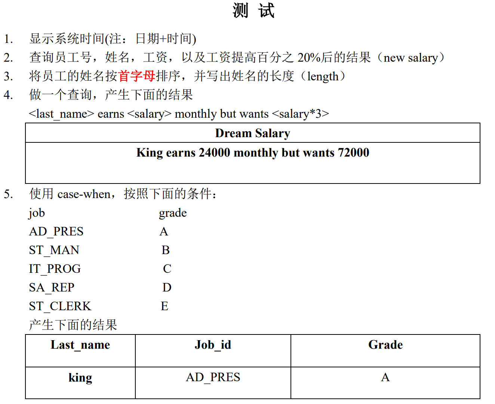
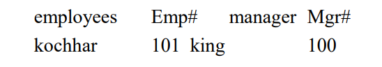
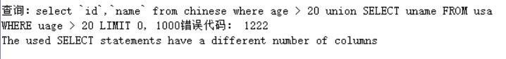
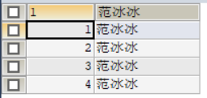

## 目录

* 数据库语言分类
  * 快速导入SQL脚本到SQLyog
* 进阶一：基础查询
* 进阶二：条件查询


### 1. 分类

* DDL（Data Definition Language）：数据定义语言，用来定义数据库：库、表、列

* **DML（Data Manipulation Language）：数据操作语言，用来定义数据库记录（数据）。**

* DCL（Data Control Language）：数据控制语言，用来定义访问权限和安全级别。
* **DQL（Data Query Language）：数据查询语言，用来查询记录（数据）。**


### 1.2 补充：快速导入SQL脚本到SQLyog


## 2. 基础查询

```mysql
# 进阶一：基础查询
/*
语法：
select 查询列表 from 表名

特点：
1、查询的结果集 是个虚拟表
2、select 查询列表 类似于System.out.println(打印内容)

select后面跟的查询列表，可以有多个部分组成，中间用逗号隔开
例如： select 字段1，字段2，字段n，表达式 from 表；

System.out.println 的打印内容，只能有一个

3、执行顺序
 1. from 子句
 2. select 子句
 
4、查询列表可以是：字段、表达式、常量、函数、变量等

*/

# 一、查询常量
select 100;

# 二、查询表达式
select 100%3;

# 三、查询单个字段
select `last_name` from `employees`;

# 四、查询多个字段
select `last_name`,`email`,`employee_id` from `employees`;

# 五、查询全部字段
select * from `employees`;

# F12：长命令格式化（reformating）
# 例如：SELECT `last_name`,`first_name`,`commission_pct`,`salary` FROM `employees`;
# 选中这一行，按F12
SELECT 
  `last_name`,
  `first_name`,
  `commission_pct`,
  `salary` 
FROM
  `employees` ;
  
# 六、查询函数（调用函数，获取返回值）
select DATABASE();  # 查询当前操作的数据库是哪个
select VERSION();   # MySQL版本号
select USER();   	# 查询当前用户名

# 七、起别名（两种方式）
# 方式一：使用 as 关键词
select USER() as 用户名;     # 不规范
select USER() as '用户名';	  # 规范
select USER() as "用户名";	  # 规范

select `Last_name` as '姓名' from `employees`; 

# 方式二：使用空格
select USER() '用户名';	  # 规范
select USER() "用户名";	  # 规范
select `Last_name` '姓名' from `employees`; 

# 八、拼接数据 CONCAT()
-- 需求：查询 first_name 和 last_name 拼接成的全名，最终起别名为：姓 名

# 方案一：  X 
select first_name+last_name as "姓名" from employees;

# 方案二：  √
# trick：若你忘了或不知道CONCAT函数的参数，可以只输入 ( ，接着就会出现提示
SELECT CONCAT(first_name,last_name) AS "姓 名" FROM `employees`

/*
Java中+的作用：
1、加法运算
	100+1.5	’a‘+2	1.3+’2‘
2、拼接符
	至少有一个操作数为字符串："hello"+'a'
	

mysql中+的作用：
1、两个操作数都是数值
100+1.5

2、其中一个操作数为字符型
将字符型数据强制转换成数值型，如果无法转换，则直接当作0处理

'张无忌'+100===》0+100===》100

3、其中一个操作数为null

null+null===》null
3+null===》null
*/

# *** 八点一、即将拼接的数据存在null


# 九、distinct的使用
#需求：员工涉及的部门编号有哪些
SELECT department_id FROM `employees`;  # 会出现重复
SELECT DISTINCT department_id FROM `employees`;  # 去重

# 十、查看表结构(两种方式)
# 1. 推荐！
DESC employees;
# 2.
SHOW COLUMNS FROM employees;

```


2021/01/26 课后小测验：

```mysql
1. 下面的语句是否可以执行成功
select last_name , job_id , salary as sal
from employees;
2. 下面的语句是否可以执行成功 
select * from employees;
3. 找出下面语句中的错误
select employee_id , last_name，
salary * 12 “ANNUAL SALARY”
from employees;
4. 显示表 departments 的结构，并查询其中的全部数据
select * from `departments`;
5. 显示出表 employees 中的全部 job_id（不能重复）
select distinct job_id from `employees`;
6. 显示出表 employees 的全部列，各个列之间用逗号连接，列头显示成 OUT_PUT
# 重点 使用CONCAT时，如果其中一个字段下二点数据为null，则拼接结果为null，也就是拼接的数据不能出现null
# 而其中 commition 字段 会出现 null 数据，解决办法是用 ifnull 函数进行替换
/*
ifnull(表达式1, 表达式2)
如果为null，则运行表达式1，否则运行表达式2
*/
SELECT CONCAT(`first_name`,',',IFNULL(`commission_pct`,'')) FROM `employees`;
```


### 进阶二：条件查询

```mysql
/*
语法：

select 查询列表
from 表名
where 筛选条件

执行顺序：
1. from 子句
2. where 子句
3. select 子句

select last_name,first_name from employees where salary>2000;

特点：
1、按条件表达式筛选

关系表达式： >	<	>=	<=	=	<>	(也可以使用 != 替代<>，但是不推荐)

2、按逻辑表达式筛选
逻辑运算符： and	or	not (也可以使用 &&	||	! 替代，但是不推荐)

3、模糊查询
like
in
between and
is null
*/
# 1、按条件表达式筛选
# Case 1: 查询部门编号不是100的员工信息
select * 
from employees
where department_id<>100 

# case 2：查询工资小于1500的姓名和工资
select last_name,salary
from emploees
where salary<15000


# 2、按逻辑表达式筛选
# case1：查询部门编号不是50-100之间的员工姓名、部门编号、邮箱
# 方案一：
select last_name,department_id，email
from employees
where department_id>100 or department_id<50；
# 方案二：语义性更强
select last_name,department_id，email
from employees
where not(department_id<=100 and department_id>=50)；

# case 2：查询奖金率>0.03 或者 员工编号在60-110之间的员工信息
SELECT * 
FROM employees
WHERE IFNULL(0,commission_pct)>0.03 OR (employee_id<=110 AND employee_id>=50);


# 3、模糊查询：一般和通配符搭配使用，对字符型数据进行部分匹配查询
# 常见通配符
# 1. _ 任意单个字符
# 2. % 任意多个字符
## LIKE：模糊查询搭配通配符 case1-5
# 扩展：not like()
# case 1：查询名字中间包含a的员工信息
SELECT * 
FROM employees
WHERE last_name like "%a%";
SELECT * 
FROM employees
WHERE last_name LIKE "%a%";

# case2：查询姓名中最后一个字符为e的员工信息
SELECT * 
FROM employees
WHERE last_name LIKE "%e";

# case3：查询姓名中第一个字符为e的员工信息
SELECT * 
FROM employees
WHERE last_name LIKE "e%";

# case4：查询姓名中第三个字符为x的员工信息
SELECT * 
FROM employees
WHERE last_name LIKE "__x%";

# case5：查询姓名中第二个字符为_的员工信息
SELECT * 
FROM employees
WHERE last_name LIKE "_\_%";

# 引申：自定义’$‘转义字符
SELECT * 
FROM employees
WHERE last_name LIKE "_$_%" escape '$';

## IN：查寻某字段的信息是否在指定列表内

# 语法：in(常量值1,..,常量值n)
# 扩展：not in()
# case1:查询部门编号是30/50/90的员工名、部门编号
SELECT last_name,department_id
FROM employees
WHERE department_id IN(30,50,90);

# case2:查询工种编号不是ST_CLEAR 或IT_PRO 的员工信息
SELECT *
FROM employees
WHERE job_id NOT IN('ST_CLEAR','IT_PRO');

## between and
/*
判断某个字段的值是否介于

between and/ not between and

问题：是只能用于数值型查询吗？
*/
# 案例一：查询部门编号在30到90之间的员工编号及姓名
SELECT department_id, last_name
FROM employees
WHERE department_id BETWEEN 30 AND 90;
# 等价于
SELECT department_id, last_name
FROM employees
WHERE department_id>=30 AND department_id<=30;

# ***案例二：查询年薪不是100000-200000之间的员工姓名、工资、年薪
# 这道题很重要的点在于别名的适用范围，出现在select语句的别名并不能在from后出现，而在from语句定义的别名就可以用在from后面
# ***重点：ifnull(判断字段,真值的操作)， e.g.IFNULL(commission_pct,0)
SELECT last_name, salary, salary*12*(1+IFNULL(commission_pct,0)) annual_salary
FROM employees
WHERE salary*12*(1+IFNULL(commission_pct,0)) NOT BETWEEN 100000 AND 200000;
/*# 这道题很重要的点在于别名的适用范围，出现在select语句的别名并不能在from后出现，而在from语句定义的别名就可以用在from后面
	错误示范：
SELECT last_name, salary, salary*12*(1+IFNULL(commission_pct,0)) annual_salary
FROM employees
WHERE annual_salary NOT BETWEEN 100000 AND 200000;
*/


## is null/is not null
# case1:查询没有奖金的员工信息
SELECT *
FROM employees
WHERE commission_pct IS NULL;
# case2:查询有奖金的员工信息
SELECT *
FROM employees
WHERE commission_pct IS NOT NULL;
/*
# 错误示范：
SELECT *
FROM employees
WHERE commission_pct = NULL;

=		只能判断普通的内容
IS		只能判断NULL值
<=>		安全等于，既能判断内容也能判断NULL值
*/


```

课后小测：
1.查询工资大于12000的员工姓名和工资

```mysql
SELECT last_name,salary
FROM employees
WHERE salary >= 12000; 
```

2.查询员工号为176的员工的姓名和部门号和年薪

```mysql
SELECT last_name,department_id,salary*12*(1+IFNULL(commission_pct,0))
FROM employees
WHERE employee_id = 176; 
```

3.选择工资不在5000到12000的员工的姓名和工资

```mysql
SELECT last_name,salary
FROM employees
WHERE salary NOT BETWEEN 5000 AND 12000; 
```

4.选择在20或50号部门工作的员工姓名和部门号

```mysql
SELECT last_name,department_id
FROM employees
WHERE department_id = 20 OR department_id = 50; 

# 或者
SELECT last_name,department_id
FROM employees
WHERE department_id in (20,50);
```

5.选择公司中没有管理者的员工姓名及job_id

```mysql
SELECT last_name,job_id
FROM employees
WHERE manager_id IS NULL; 
```

6.选择公司中有奖金的员工姓名，工资和奖金级别

```mysql
SELECT last_name,salary,commission_pct
FROM employees
WHERE commission_pct IS NOT NULL; 
```

7.选择员工姓名的第三个字母是a的员工姓名

```mysql
SELECT last_name
FROM employees
WHERE last_name LIKE "__a%"; 
```

8.选择姓名中有字母a和e的员工姓名

```mysql
SELECT last_name
FROM employees
WHERE last_name LIKE "%a%" AND last_name LIKE "%e%";

#或者
SELECT last_name
FROM employees
WHERE last_name LIKE "%a%e" OR last_name LIKE "%e%a";
```

9.显示出表employees表中first_name 以'e'结尾的员工信息

```mysql
SELECT *
FROM employees
WHERE first_name LIKE "%e"; 
```

10.显示出表employees部门编号在80-100之间的姓名、职位

```mysql
SELECT last_name,job_id
FROM employees
WHERE department_id BETWEEN 80 AND 100; 
```

11.显示出表employees的manager_id 是100,101,110 的员工姓名、职位

```mysql
SELECT last_name,job_id
FROM employees
WHERE manager_id IN (100,101,110); 
```


## 进阶三：排序查找

```mysql
/*
语法：

select 查询列表
from 表名
[where 筛选条件]
order by 排序列表

:1 from子句
:2 where子句
:3 select子句
:4 order by子句

举例：
select last_name,salary
from employees
where salary>20000
order by salary;
（凡是敲代码请在SQLyog敲，有补全）

特点：
1、排序列表可以是单个字段、多个字段、表达式、函数、列数，以及以上的组合
2、升序，通过asc【不写默认】
3、降序，通过desc
*/
# 一、按单个字段排序
SELECT * FROM employees WHERE employee_id>120 ORDER BY salary;
# 等价于
SELECT * FROM employees WHERE employee_id>120 ORDER BY salary ASC;
# case1：将员工编号大于120的员工信息进行工资的降序
SELECT * FROM employees WHERE employee_id>120 ORDER BY salary DESC;

# 二、按年薪降序（用别名）
# case1.对有奖金的员工，按年薪降序
SELECT *,salary*12*(1+IFNULL(commission_pct,0)) annual_salary 
FROM employees WHERE commission_pct IS NOT NULL 
ORDER BY annual_salary DESC;
# 为什么where不能用别名，而order by可以呢？
# 原因在于操作顺序：from->where->select->order by
# where在select之前操作，所以别名不能用！

# 三、按函数的结果排序
# case1.按姓名的字数长度进行排序
SELECT LENGTH(last_name),last_name
FROM employees
ORDER BY LENGTH(last_name);

# 四、按多个字段排序
# case1.查询员工的姓名、工资、部门编号，先按工资升序，再按部门编号降序
SELECT last_name,salary,department_id
FROM employees
ORDER BY salary ASC,department_id DESC;

# 五、按列数排序（用的少）
# case1.按第二列的顺序排列
SELECT *
FROM employees
ORDER BY 2;
```

课后小测：

1、查询员工的姓名和部门号和年薪，按年薪降序按姓名升序

```mysql
SELECT last_name,department_id,salary*12*(1+IFNULL(commission_pct,0)) annual_salary
FROM employees
ORDER BY annual_salary DESC,last_name ASC;
```

2.选择工资不在8000到17000的员工的姓名和工资，按工资降序

```mysql
SELECT last_name,salary
FROM employees
WHERE salary NOT BETWEEN 8000 AND 17000
ORDER BY salary ASC;
```

3.查询邮箱中包含e的员工信息，并先按邮箱的字节数降序，再按部门号升序

```mysql
SELECT *
FROM employees
WHERE email LIKE '%e%'
ORDER BY LENGTH(email) DESC,department_id ASC;

```


## 进阶四：常见函数

```mysql
/*
函数：类似java中的“方法”
为了解决某个问题，将编写的一系列的命令集合封装在一起，对外仅仅暴露方法名，供外部调用

1、自定义方法（函数）
2、调用方法（函数）
	叫什么：函数名
	干什么：函数功能

常见函数：
	字符函数
		concat
		length
		char_length
		lpad
		rpad
		instr
		left
		right
		substr + 
		subcmp
		upper
		lower
		trim
	数学函数
		abs
		CELL
		FLOOR
		ROUND
		MOD
		TRUNCATE
	日期函数
		now
		curdate
		curtime
		date_format
		STR_TO_DATE
	流程控制函数
		if
		case
*/

# 一、字符函数
# 1、CONCAT 拼接字符
SELECT CONCAT('hello,',first_name,last_name) 
FROM employees;
# 2、length 获取字节长度
SELECT LENGTH('hello,郭襄');
# 3、char_length 获取字符长度（字符个数）
SELECT CHAR_LENGTH('hello,郭襄');
# 4、SUBSTRING 截取字串
/*
注意：其实索引从1开始而不是0
substr(str,起始索引,截取字符长度)
substr(str,起始索引)
*/
SELECT SUBSTR('张三丰爱上了郭襄',1,3);
SELECT SUBSTR('张三丰爱上了郭襄',7,3);
# 5、INSTR 获取字符第一次出现的索引
select INSTR('三打白骨精aaa白骨精白骨精','白骨精');
# TRIM 去前后指定发的字符，默认是去空格
SELECT TRIM(' 虚 竹  ') AS a;
SELECT TRIM('x' FROM 'xxx虚x竹xxxxxxxxxx');
# 6、LPAD/RPAD	左填充/右填充
SELECT LPAD('木婉清',10,'a');
# ========
# aaaaaaa木婉清
# ========
# 7、UPPER/LOWER 变大写/变小写
# case1.查询员工表的姓名，要求格式：姓首字母大写，其他字符小写，名所有字符大写，且姓和名之间用_分隔，最后起别名“OUTPUT”
SELECT CONCAT(UPPER(SUBSTR(last_name,1,1)),LOWER(SUBSTR(last_name,2,LENGTH(last_name)-1)),'_',UPPER(first_name))
FROM employees;
# 8、STRCMP 比较两个字符的大小
SELECT STRCMP('abc','abc')； # 左大1，相等右大则为0
# 9、left/right
SELECT RIGHT('鸠摩智',1); # 智
SELECT LEFT('鸠摩智',1); # 鸠

# 二、数学函数
# 1、ABS 绝对值
select ABS(-1);

# 2、CELL 向上取整 返回>=该参数的最小整数
select CELL(1.01);
select CELL(1.01);
select CELL(1.0);

# 3、floor 向下取整
select floor(1.01);

# 4、ROUND 四舍五入
select ROUND(3.1415);
select ROUND(3.1415,2);

# 5、TRUNCATE 截断
# 语法：select TRUNCAT(3.1415,小数点多少位);
select TRUNCATE(3.1415,0);

# 6、MOD 取余
select MOD(-10,3);

# 三、日期函数
# 1. NOW
select now();

# 2. curdate

# 3. curtime

# 4. datediff 左减右
select datediff('1998-7-16',curdate());

# 5、DATE_FORMAT
select date_format('1997-1-30','%Y年%m月%d日 %h小时%i分钟%s秒');
# case1. 把员工表中的hiredate转成特定格式
SELECT DATE_FORMAT(hiredate,'%Y年%m月%d日 %h小时%i分钟%s秒') 入职日期
FROM employees;

# 6、STR_TO_DATE 按规定格式解析字符串为日期格式
SELECT STR_TO_DATE('3/2 2021','%m/%d %Y');

# case1.查找入职时间比 3/2 2021 早的员工信息
SELECT *
FROM employees
WHERE hiredate<STR_TO_DATE('3/15 1998','%m/%d %Y');


# 六、流程控制函数
# 1、IF函数（三元运算符）
SELECT IF(100>9,'好','坏');
# case1.如果有奖金，则显示奖金，如果没有，则显示0
SELECT IF(commission_pct IS NOT NULL,salary*12*commission_pct,0) 奖金, commission_pct
FROM employees;

# 2、case函数
/*
:1、类似于swich语句
CASE 表达式
when 值1 then 结果1
when 值2 then 结果2
...
else 结果n
end
*/
# case1.部门编号为30，工资显示为2倍；部门编号为40，工资显示为3倍；部门编号为50，工资显示为4倍；否则不变
# 显示 部门编号，新工资，旧工资
SELECT department_id,salary,
CASE department_id
WHEN 30 THEN salary * 2
WHEN 40 THEN salary * 3
WHEN 50 THEN salary * 4
ELSE salary
END new_salary

FROM employees;

/*
:2、情况2，类似于多重if语句，实现区间判断
case1.如果工资>20000,显示级别A；如果工资>15000,显示级别B；如果工资>10000,显示级别C；否则，显示D
CASE 
when 表达式1 then 结果1
when 表达式2 then 结果2
...
else 结果n
end
*/
SELECT 
CASE 
WHEN salary>20000 THEN 'A'
WHEN salary>15000 THEN 'B'
WHEN salary>10000 THEN 'C'
ELSE 'D'
END class

FROM employees;
/*	错误示范：
SELECT 
CASE salary
WHEN salary>20000 THEN 'A'
WHEN salary>15000 THEN 'B'
WHEN salary>10000 THEN 'C'
ELSE 'D'
END class

FROM employees;

*/
```



```mysql
#1
SELECT NOW();
##  SELECT curdate(),curtime();

#2
SELECT employee_id,last_name,salary,salary*(1+0.2) "new salary"
FROM employees;

#3
SELECT last_name,LENGTH(last_name)
FROM employees
ORDER BY SUBSTR(last_name,1,1);

#4
SELECT CONCAT(last_name,' earns ',salary,' monthly but wants ',salary*3) "Dream Salary"
FROM employees;

#5
SELECT last_name,job_id,
CASE job_id
WHEN "AD_PRES" THEN "A"
WHEN "ST_MAN" THEN "B"
WHEN "IT_PROG" THEN "C"
WHEN "SA_REP" THEN "D"
WHEN "ST_CLERK" THEN "E"
END
FROM employees;
```


## 进阶5：分组函数

```mysql
/*
说明：分组函数往往用于实现将一组数据进行统计，最终得到一个值，又称聚合函数或统计函数

分组函数清单：

sum(字段名) :求和
avg(字段名) ：求平均值
max(字段名) ：求最大值
min(字段名) ：求最小值
count(字段名) ：计算非空字段的个数

*/

# 案例1：查询员工信息白哦中的工资和、工资平均值、最高工资、最低工资、有工资的个数
SELECT SUM(salary),MAX(salary),MIN(salary),AVG(salary),COUNT(salary)
FROM employees;
# count 补充介绍* -- count(*)
## 1.统计结果集的行数，推荐使用count(*)+where
select count(*) from employees;
SELECT COUNT(*) FROM employees WHERE department_id=30;
### 不经常用的 count(1):跟count(*)是一样
## 2.搭配distinct实现去重的统计
# 需求：有员工的部门个数（究竟重复的是啥）
SELECT COUNT(DISTINCT department_id) FROM employees WHERE department_id;
# 思考：每个部门的总工资和、平均工资？涉及分组查询！！！
SELECT department_id,SUM(salary),AVG(salary) 
FROM employees 
GROUP BY department_id;
# 思考：和分组查询字段一起的select字段必须是分组条件，否则没有意义，错误示范如下(employee_id是无意义的)
SELECT department_id,SUM(salary),AVG(salary),employee_id
FROM employees 
GROUP BY department_id;
```


#### 分组函数课后练习

1.查询各job_id的员工工资的最大值，最小值，平均值，总和，并按job_id升序

```mysql
SELECT MAX(salary),MIN(salary),AVG(salary),SUM(salary),job_id
FROM employees
GROUP BY job_id
ORDER BY job_id ASC;
```

2.查询员工最高工资和最低工资的差距（DIFFERENCE）

```mysql

```

3.查询各个管理者手下员工的最低工资，其中最低工资不能低于6000，没有管理者的员工不计算在内

```mysql

```

4.查询所有部门的编号，员工数量和工资平均值,并按平均工资降序

```mysql

```

5.选择具有各个job_id的员工人数

```mysql

```


## 进阶6：分组查询

```mysql
/*
语法：
select 查询列表
from 表名
where 筛选条件
group by 分组列表
having 分组后查询
order by 排序列表;

执行顺序：
：1.from子句
：2.where子句
：3.group by子句
：4.having子句
：5.select子句
：6.order by子句

特点：
1.查询列表往往是 分组函数和被分组的字段
2.分组查询的筛选分为两类
				筛选的基表	使用的关键词		位置
分组前筛选		  原表		 where		group by前面
分组后筛选  		  分组后的结果集	 having		 group by后面

where--group by--having

问题：分组函数做条件，用having

*/
# 1）简单分组
## case1.查询每个工种的员工平均工资
SELECT AVG(salary),job_id 
FROM employees 
GROUP BY job_id;
## case2.查询每个领导手下的个数***算个数要想到要用到count
SELECT COUNT(*),manager_id 
FROM employees
where manager_id is not null
GROUP BY manager_id;
# 2）实现分组前的查询
## case3.邮箱中包含a字符的 每个部门的最高工资
SELECT MAX(salary),department_id 
FROM employees
WHERE email LIKE "%a%"
GROUP BY department_id;
## case4.查询每个领导手下有奖金的员工的平均工资
SELECT AVG(salary),manager_id
FROM employees
WHERE commission_pct IS NOT NULL
GROUP BY manager_id;
# 3）实现分组后的查询***
## case1.查询哪个部门员工个数大于5***
## 分析1：查询每个部门的员工个数
SELECT COUNT(*),department_id
FROM employees
GROUP BY department_id;
## 分析2：having 搭配分组查询
SELECT COUNT(*),department_id
FROM employees
GROUP BY department_id
HAVING COUNT(*) > 5;
# case2.每个工种有奖金的员工的最高工资>12000的公作编号和最高工资
SELECT job_id,MAX(salary)
FROM employees
WHERE commission_pct IS NOT NULL
GROUP BY job_id
HAVING MAX(salary) > 12000;
# case3.领导编号>102的每个领导手下的最低工资大于5000的最低工资
## 方式1：推荐，能显示出顺序
SELECT MIN(salary),manager_id
FROM employees
WHERE manager_id>102
GROUP BY manager_id
HAVING MIN(salary) > 5000;
## 方式2：不推荐，但是也能工作
SELECT MIN(salary),manager_id
FROM employees
GROUP BY manager_id
HAVING MIN(salary) > 5000 and manager_id>102;
# 4） 可以实现排序
## case1 查询没有奖金的员工的最高工资大于6000的工种编号和最高工资，按最高工资排序
#分析1 按工种分组，查询每个工种有奖金的员工的最高工资
SELECT MAX(salary) 最高工资,job_id
FROM employees
WHERE commission_pct IS NULL
GROUP BY job_id
HAVING MAX(salary) > 6000
ORDER BY MAX(salary) ASC;
# 5）按多个字段进行分组
## case1：查询每个工种每个部门的最低工资，并按最低工资降序
## 提示：工种和部门编号要一致，没有先后之分
SELECT MIN(salary) 最低工资,job_id,department_id
FROM employees
# where commission_pct is null
GROUP BY job_id,department_id
# having MAX(salary) > 6000
ORDER BY MIN(salary) DESC;

# ==================SQL92=====================
# 一、内连接
# 一）等值连接
/*
语法：
		select 查询列表
		from 表名1 别名1,..,表名n 别名n
		where 等值连接的条件
特点：
		1、为了解决多表中字段名重名问题，往往为表起别名，提高语义性
		2、表的顺序无要求
*/
# 1）简单的两表连接
## case1 查询员工名和部门名
USE myemployees;
SELECT last_name,department_name
FROM employees e,departments d
WHERE e.department_id=d.department_id;
## 起完别名，select不能用源表名限定，只能用别名限定！！！！因为执行顺序
USE myemployees;
SELECT e.last_name,d.department_name
# SELECT employees.last_name,department.department_name 【Wrong！】
FROM employees e,departments d
WHERE e.department_id=d.department_id;

# 2）添加筛选条件
## case1.查询部门编号>100的部门名和所在城市的城市名
SELECT department_name,city
FROM departments d,locations l
WHERE d.location_id=l.location_id AND d.`department_id`>100;
## case2.查询有奖金的员工名、部门名
USE myemployees;
SELECT e.last_name,d.department_name
FROM employees e,departments d
WHERE e.department_id=d.department_id AND e.commission_pct IS NOT NULL;
## case3.查询城市名中第二个字符为o的部门名和城市名
SELECT department_name,city
FROM departments d,locations l
WHERE d.location_id=l.location_id AND l.`city` LIKE '_o%';

# 3）添加分组+筛选
## case1 查询每个城市的部门数
SELECT COUNT(department_name),city
FROM departments d,locations l
WHERE d.location_id=l.location_id
GROUP BY city;
## case2 查询有奖金的每个部门的部门名和部门的领导编号和该部门的最低工资
SELECT e.department_id,e.manager_id,MIN(salary)
FROM departments d,employees e
WHERE d.`department_id`=e.`department_id` AND e.`commission_pct` IS NOT NULL
GROUP BY e.department_id;
## case3 查询部门中员工个数>10的部门名
SELECT d.department_name
FROM departments d,employees e
WHERE d.`department_id`=e.`department_id`
GROUP BY e.department_id
HAVING COUNT(*)>10;
# 4）添加分组+筛选+排序
## case 查询那个部门的员工个数>5，并按员工个数进行排序
SELECT d.department_name,COUNT(*)
FROM departments d,employees e
WHERE d.`department_id`=e.`department_id`
GROUP BY e.department_id
HAVING COUNT(*)>5
ORDER BY COUNT(*) ASC;

# 5）三表查询
## case. 查询员工名、部门名和所在的城市
SELECT last_name,department_name,city
FROM employees e,departments d,locations l
WHERE e.`department_id`=d.`department_id` AND d.`location_id`=l.`location_id`;


# 二）非等值连接
## case1 查询员工的工资和工资级别，job_grades没有创建出来
select salary,grade_level
from employees e,job_grades g
where salary between g.lowest_sal and g.highest_sal
and g.highest_sal='A'

# 三）自连接
## case 查询员工名和上级的名称***（出现上下级，且manager_id跟employee_id一致）
## 错误示范
SELECT last_name,employee_id,manager_id
FROM employees;
/* =========
King—— 100 （NULL）
*/
## 正确示范
SELECT e.last_name,e.employee_id,m.last_name,m.employee_id
FROM employees e,employees m
WHERE e.`manager_id`=m.`employee_id`;
#where d.`department_id`=e.`department_id`

# ============SQL99语法
# 一、内连接
/*
语法：

select 查询列表
from 表名1 别名
【inner】 join 表名2 别名
on 连接条件
where 筛选条件
group by 分组列表
order by 排序列表

SQL92和SQL99的区别：
	SQL99，使用join关键字代替之前的逗号，并且将连接条件和筛选条件进行了分离，提高阅读性！！！
	

*/
#一）等值连接
## case1 查询员工名和部门名
SELECT last_name,department_name
FROM employees e
INNER JOIN departments d ON e.`department_id`=d.`department_id`;
## case1.查询部门编号>100的部门名和所在城市的城市名
SELECT department_name,city
FROM departments d
INNER JOIN locations l ON d.`location_id`=l.`location_id`
WHERE d.`department_id` > 100;
## case1 查询每个城市的部门数
SELECT COUNT(department_name),city
FROM departments d
INNER JOIN locations l ON d.`location_id`=l.`location_id`
GROUP BY l.city;
## case 查询那个部门的员工个数>5，并按员工个数进行排序
SELECT d.department_name
FROM departments d
INNER JOIN employees e ON d.`department_id`=e.`department_id`
GROUP BY e.department_id
HAVING COUNT(*)>10;
## case. 查询员工名、部门名和所在的城市
SELECT last_name,department_name,city
FROM employees e
INNER JOIN departments d ON e.`department_id`=d.`department_id`
INNER JOIN locations l ON d.`location_id`=l.`location_id`;
#二）非等值连接
## 空
#三）自连接
## case1 查询员工名和上级的名称
SELECT e.last_name,e.manager_id,m.last_name,m.employee_id
FROM employees e
INNER JOIN employees m ON e.`manager_id`=m.`employee_id`;
```

#### SQL92课后测试（解题用SQL99语法）

1.显示所有员工的姓名，部门号和部门名称。

```mysql
USE mymployees;
SELECT e.last_name,e.department_id,d.department_name
FROM `employees` e INNER JOIN `departments` d ON e.department_id=d.department_id;
```

2.查询90号部门员工的job_id和90号部门的location_id

```mysql
SELECT e.job_id,d.`location_id`
FROM `employees` e INNER JOIN `departments` d ON e.department_id=d.department_id;
```

3.选择所有有奖金的员工的last_name,department_name,location_id,city

```mysql
SELECT last_name,department_name,d.location_id,city
FROM `employees` e
INNER JOIN `departments` d 
ON e.department_id=d.department_id
INNER JOIN `locations` l
ON l.`location_id`=d.`location_id`
WHERE e.`commission_pct` IS NOT NULL;
```

4.选择city在Toronto工作的员工的last_name , job_id , department_id , department_name 

```mysql
SELECT last_name,job_id,e.department_id,department_name
FROM `employees` e
INNER JOIN `departments` d 
ON e.department_id=d.department_id
INNER JOIN `locations` l
ON l.`location_id`=d.`location_id`
WHERE l.`city`='Toronto';
```

5.查询每个工种、每个部门的部门名、工种名和最低工资

```mysql
SELECT e.job_id,department_name,job_title,MIN(salary)
FROM `employees` e
INNER JOIN `departments` d 
ON e.department_id=d.department_id
INNER JOIN `jobs` j
ON e.`job_id`=j.`job_id`
GROUP BY job_id,e.department_id;
```

6.查询每个国家下的部门个数大于2的国家编号

```mysql
SELECT country_id,COUNT(department_id)
FROM `departments` d 
INNER JOIN `locations` l
ON l.`location_id`=d.`location_id`
GROUP BY l.`country_id`
HAVING COUNT(department_id)>2;
```

7、选择指定员工的姓名，员工号，以及他的管理者的姓名和员工号，结果类似于下面的格式



```mysql
SELECT e.last_name "employees",e.employee_id "Emp#",m.last_name "manager",e.manager_id "Mgr#"
# 注意是m.last_name "manager",e.manager_id "Mgr#"而不是m.last_name "manager",m.manager_id "Mgr#"
FROM employees e
INNER JOIN employees m
ON e.`manager_id`=m.`employee_id`;
```


```mysql
(接力上面的代码框)
# 二、外连接（左连接，右连接）
## 内外连接的区别：当这有那也有的时候【交集】，这有那可以没有【伪并集，分主从】
/*
 应用场景：用于查询一个表中有，另一个表没有的记录
 
 特点：
 1、外连接的查询结果为主表中的所有记录
	如果从表中有和它匹配的，则显示匹配的值
	如果从表中没有和它匹配的，则显示null
	外连接查询结果=内连接结果+主表中有而从表没有的记录
 2、左外连接，left join左边的是主表
    右外连接，right join右边的是主表
 3、左外和右外交换两个表的顺序，可以实现同样的效果 
 4、全外连接=内连接的结果+表1中有但表2没有的+表2中有但表1没有的
 
 语法：
 
select 查询列表
from 表1 别名
left|right join 表2 别名
on 连接条件
where 筛选条件;
*/
# case1 查询所有女神记录，以及对应的男神，如果没有则显示null
USE girls;
SELECT b.*,bo.`boyName`
FROM beauty b
LEFT JOIN boys bo
ON b.`boyfriend_id`=bo.`id`;
# case2 查询没有男朋友的女神记录***
## 左连接方式1
USE girls;
SELECT b.*,bo.`boyName`
FROM beauty b
LEFT JOIN boys bo
ON b.`boyfriend_id`=bo.`id`
WHERE bo.`id` IS NULL;
# 左连接方式2
SELECT b.*,bo.`boyName`
FROM beauty b
LEFT JOIN boys bo
ON b.`boyfriend_id`=bo.`id`
HAVING bo.`boyName` IS NULL;
# case3 查询那个部门没有员工，并显示其部门编号和部门名
SELECT d.department_id,department_name
FROM employees e RIGHT JOIN departments d
ON e.`department_id`=d.`department_id`
WHERE e.`employee_id` IS NULL;
# case4 查询没有员工，部门的数量
SELECT count(*)
FROM employees e RIGHT JOIN departments d
ON e.`department_id`=d.`department_id`
WHERE e.`employee_id` IS NULL;
```

课后测验

一、查询编号>3的女神的男朋友信息，如果有则列出详细，如果没有，用null填充

```mysql
USE girls;
SELECT b.id,b.name,bo.*
FROM beauty b LEFT JOIN boys bo
ON b.`boyfriend_id`=bo.`id`
WHERE b.`id` > 3.
```

二、查询哪个城市没有部门

```mysql
USE myemployees;
SELECT city
FROM locations l LEFT JOIN departments d
ON d.`location_id`=l.`location_id`
WHERE department_id IS NULL;
```

三、查询部门名为SAL或IT的员工信息

```mysql
# 错误示范，这样会把所有员工都显示出来，因为有些员工是没有部门的！！！
USE myemployees;
SELECT e.*
FROM employees e LEFT JOIN departments d
ON e.`department_id`=d.`department_id`
WHERE department_name = "SAL" OR department_name = "IT";
# 
USE myemployees;
SELECT d.*,e.*
FROM departments d LEFT JOIN employees e
ON e.`department_id`=d.`department_id`
WHERE department_name = "SAL" OR department_name = "IT";
```


## 进阶7：子查询

```mysql
# 子查询
/*
含义：
出现在其他语句中的select语句，称为子查询或内查询
外部的查询语句，称为主查询或外查询

分类：
按子查询出现的位置：
	1.select后面：
		要求：子查询的结果为单行单列
	
	2.from后面：
		要求：子查询的结果为多行多列
		
	3.where或having后面：★
		要求：子查询的结果必须为单列
			单行子查询 	√
            单行子查询   √
            
	4.exists后面：（相关子查询）
		要求：子查询的结果必须为单列（相关子查询）

特点：
		1.子查询放在条件中，要求放在条件的右侧
		2.子查询放在小括号内
		3.子查询的执行优于主查询
		4.单行子查询对应了 单行操作符： > < >= <= = <>
		  多行子查询对应了 多行操作符： any/some all any
		5.子查询的执行优先于主查询执行，主查询的条件用到了子查询的结果
*/
# 一、where或having后面shiu
# 1、标量子查询
##案例1：谁的工资比 Abel 高?
### Step1 找出 Abel 的工资
SELECT salary
FROM employees
WHERE last_name="Abel";
### Step2 查询员工信息，满足 salary > step1 的结果
USE myemployees;
SELECT *
FROM employees
WHERE salary>(
	SELECT salary
	FROM employees
	WHERE last_name="Abel"
);
#案例2：返回job_id与141号员工相同，salary比143号员工多的员工 姓名，job_id 和工资
USE myemployees;
SELECT last_name,job_id,salary
FROM employees
WHERE job_id=(
	SELECT job_id
	FROM employees
	WHERE employee_id=141
)
AND salary>(
	SELECT salary
	FROM employees
	WHERE employee_id=143
);
#案例3：返回公司工资最少的员工的last_name,job_id和salary
USE myemployees;
SELECT last_name,job_id,salary
FROM employees
WHERE salary=(
	SELECT MIN(salary)
	FROM employees
);
#案例4：查询最低工资大于50号部门最低工资的部门id和其最低工资
#①查询50号部门的最低工资
SELECT  MIN(salary)
FROM employees
WHERE department_id = 50

#②查询每个部门的最低工资
SELECT MIN(salary),department_id
FROM employees
GROUP BY department_id

#③ 在②基础上筛选，满足min(salary)>①
SELECT MIN(salary),department_id
FROM employees
GROUP BY department_id
HAVING MIN(salary)>(
	SELECT  MIN(salary)
	FROM employees
	WHERE department_id = 50
);

## ======课后练习======= ##
#1.查询和Zlotkey相同部门的员工姓名和工资
SELECT last_name,salary
FROM employees
WHERE department_id=(
	SELECT department_id
	FROM employees
	WHERE last_name="Zlotkey"
);

#2.查询工资比公司平均工资高的员工的员工号，姓名和工资。
SELECT employee_id,last_name,salary
FROM employees
WHERE salary>(
	SELECT AVG(salary)
	FROM employees
);

# 二）多行子查询
/*

in : 判断某字段是否在列表内  // x in(10,30,50)
any/some ： 判断某字段的值是否满足其中一个值

x>any(10,30,50)
x>min(10,30,50)

x=any(10,30,50)
x in(10,30,50)

all:判断某字段的值是否满足里面所有的

x>all(10,30,50)
x>MAX()


all

*/
# 课堂测验
## #案例1：返回location_id是1400或1700的部门中的所有员工姓名
SELECT last_name
FROM employees
WHERE department_id IN (
	SELECT distinct department_id
	FROM departments
	WHERE location_id IN (1400,1700)
);
## #案例2：返回其它工种中比job_id为‘IT_PROG’工种任一工资低的员工的员工号、姓名、job_id 以及salary
## 错误示范
SELECT employee_id,last_name,job_id
FROM employees
WHERE salary > (
	SELECT MIN(salary)
	FROM employees
	GROUP BY job_id
) AND job_id <> 'IT_PROG';
## ======错误原因：Subquery returns more than 1 row（超过一行）=======
## 正确示范
SELECT employee_id,last_name,job_id
FROM employees
WHERE salary < ANY(
	SELECT DISTINCT salary
	FROM employees
	WHERE job_id='IT_PROG'
) AND job_id <> 'IT_PROG'
;
## 等价=
SELECT employee_id,last_name,job_id
FROM employees
WHERE salary < (
	SELECT MAX(salary)
	FROM employees
	WHERE job_id='IT_PROG'
) AND job_id <> 'IT_PROG'
;
## #案例3：返回其它部门中比job_id为‘IT_PROG’部门所有工资都低的员工   的员工号、姓名、job_id 以及salary
SELECT employee_id,last_name,job_id
FROM employees
WHERE salary < ALL(
	SELECT DISTINCT salary
	FROM employees
	WHERE job_id='IT_PROG'
) AND job_id <> 'IT_PROG'
;
## 等价=
SELECT employee_id,last_name,job_id
FROM employees
WHERE salary < (
	SELECT MIN(salary)
	FROM employees
	WHERE job_id='IT_PROG'
) AND job_id <> 'IT_PROG'
;

# 二、放在select后面
## case 查询部门是50的员工个数
SELECT COUNT(*)
FROM employees
WHERE department_id=50
;
## 等价于
SELECT
(	SELECT COUNT(*)
	FROM employees
	WHERE department_id=50
) "个数";

# 三、放在from后面
## case 查询每个部门的平均工资的工资级别
## 1）查询每个部门的平均工资
SELECT AVG(salary),department_id
FROM employees
GROUP BY department_id;
## 2）将1）和sal_grade两表连接
SELECT department_id,dep.avr,s.grade_level
FROM (
	SELECT AVG(salary) "avr",department_id
	FROM employees
	GROUP BY department_id
) dep LEFT JOIN sal_grades s 
ON dep.avr BETWEEN s.lowest_sal AND s.highest_sal;

# 四、放在existd后面
## case1 员工中有无姓名为 Abel 的员工
SELECT EXISTS (
	SELECT *
	FROM employees
	WHERE last_name="Abel"

);
## case2 查询没有女朋友的男神信息(这道题要用in)
USE `girls`;
SELECT bo.*
FROM `boys` bo
WHERE bo.id IN (
	SELECT boyfriend_id
	FROM beauty
);

```


## 进阶8：分页查询

```mysql
/*
应用场景：当页面上的数据，一页显示不全，则需要分页查询

分页查询的sql命令请求数据库服务器-》服务器响应查询到的多条数据

语法：
select 查询列表
from 表1 别名
join 表2 别名
on 连接条件
where 筛选条件
group by 分组列表
having 分组后查询
order by 排序列表;
limit 起始条目索引，显示的条目数

执行顺序：
：1.from子句
：2.join子句
：3.on子句
：4.where子句
：5.group by子句
：6.having子句
：7.select子句
：8.order by子句
：9.limit 子句

特点：
：1.起始条目索引如果不写，默认从0开始
：2.limit后面支持两个参数
参数1：显示其实条目索引
参数2：条目数

公式
假如显示的页数是page，每页显示的条目数为size
select *
from employees
limit (page-1)*size,size
page	size
1				limit 0,10
2				limit 10,10
3				limit 20,10
4				limit 30,10
*/
## case1 查询员工信息表的前5条
SELECT *
FROM employees
LIMIT 0,5;
## 等价与
SELECT *
FROM employees
LIMIT 5;
## case2.查询有奖金的，且工资较高的第11名到20名
USE myemployees;
SELECT *
FROM employees
WHERE commission_pct IS NOT NULL
ORDER BY salary ASC
LIMIT 10,10;
```

#### 要注意的：

##### 对于字符的位置，从1开始

##### 对于行数，从0开始


## 进阶9：联合查询

```mysql
/*
说明：要查询的结果来自于多个表，且多个表没有直接的连接关系，这个时候往往使用联合查询，也称为union查询

select 查询列表 from 表1  where 筛选条件
union
select 查询列表 from 表2  where 筛选条件

特点：★
1、要求多条查询语句的查询列数是一致的，查询类型、字段意义最好一致
2、union去重查询
	union all 实现全部查询，包括重复项

*/
# 案例：查询所有国家年龄大于20岁的用户信息
SELECT * FROM chinese WHERE age > 20
UNION
SELECT * FROM usa WHERE uage > 20;
# 案例2：查询所有国家的用户姓名和年龄
SELECT id,name FROM chinese
UNION
SELECT uid,uname FROM usa;
## 错误示范，查询列表列数不同时会出错
SELECT id,name FROM chinese
UNION
SELECT uname FROM usa;
```



```mysql
# case3： union 自动去重 / union all 支持展示所有重复项
## 情景一
SELECT 1,'范冰冰'
UNION 
SELECT 2,'范冰冰'
UNION 
SELECT 3,'范冰冰'
UNION 
SELECT 4,'范冰冰'
```



```mysql
## ```mysql
## 情景2（重复则去重）
SELECT 1,'范冰冰'
UNION 
SELECT 1,'范冰冰'
UNION 
SELECT 1,'范冰冰'
UNION 
SELECT 1,'范冰冰'
```


