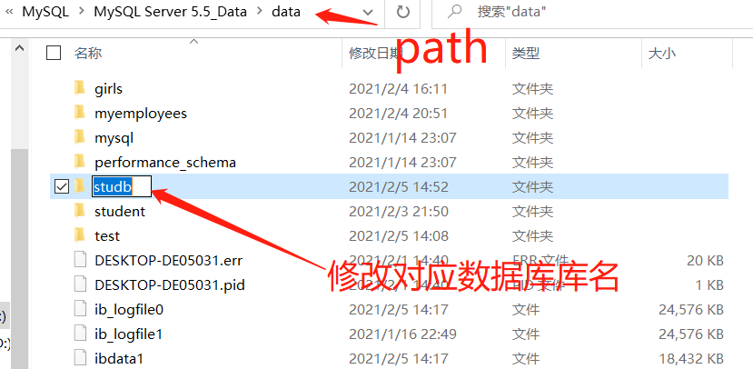

# DDL--Data Definiton Language（数据定义语言）

```mysql
/*
说明：用于对数据库和表的管理和操作

*/

# ------------库的管理------------
#一、创建数据库
CREATe database stuDB;
## 推荐写法
CREATe database if not exists stuDB;

#二、删除数据库
drop database stuDB;
## 推荐写法
drop database if exists stuDB;

#三、一般不修改表名，除非很特殊
```



```mysql
# ------------表的管理------------
#一、创建表 *
/*
数据类型：
一、整型
TINYINT	SMALLINT INT(1) BIGINT

二、浮点型
# double(5,2),整数位+小数位=5，小数位=2
# 特点：(5,2)可写可不写，一般不写
floart(5,2) double(5,2) decimal(5,2)

三、字符型
char(n) -- n:字符数，可选
varchar(n) -- n:字节数，必选
text

四、日期型
date
time
datetime
timestamp（和datetime一样的格式，只是范围小了点）

五、二进制型（用于存储图片，必须用jdbc来操作）
# 一）按存储大小降序
tinyblob
blob
mediumblob
largeblob

# 二）常见约束（六大约束）===================
/*
说明：用于限制表中字段的数据的，从而进一步保证数据表的数据是一致的、准确的、可靠的！

1.NOT NULL 非空：用于限制字段为必填项
2.DEFAULT 默认：用于限制该字段没有显示插入值，则直接显示默认值
3.PRIMARY KEY 主键：用于限制该字段的值不能重复，设置主键列默认非空
# <keyPoint> 可以设置多字段为组合主键时，三个字段的值只要有一个不重复就行就可以
# 例如： 下面的极端情况都是可以的
stuid	stuname	  gender  borndate
1		张三		男		null
2		张三		男		null
1		张三		女		null

4.UNICODE 唯一：用于限制该字段的值不能重复
# <keyPoint> 
			字段是否为空		一个表可以有几个
主键			x				1个
唯一键			√				n个

5.CHECK 检查键：用于限制该字段必须满足指点条件（mysqlu不支持）
	CHECK(age between 1 and 100)


6.FOREIGN KEY 外键：用于限制两个表的关系，要求外键列的值必须来自主表的关联列
	要求：
	：1.主表的关联列和从表的关联列类型必须一致，意思一样，名称无要求
	：2.主表的关联列要求必须是主键
# case1 对于同样意义的列（major_id），用表1（major）存在的行来限制表2（student）的（major_id）的值

# case2 添加约束的例子
## 注意：注释前不用像python那样空一格
## 注意：外键得另起一行写！！！
DROP TABLE IF EXISTS stuinfo;
USE student;
CREATE TABLE IF NOT EXISTS stuinfo(
	stuid INT PRIMARY KEY,# 添加主键约束
	stuname VARCHAR(20) UNIQUE,# 添加唯一约束+非空
	stugender CHAR DEFAULT '男',# 添加默认约束------------------------------------------------------------------------------------------------------
	email VARCHAR(20) NOT NULL,# 添加非空约束
	age INT CHECK(age BETWEEN 18 AND 25),# 添加检查约束，但是mysql不支持
	majorid INT,
	CONSTRAINT fk_stuinfo_major FOREIGN KEY (majorid) REFERENCES major(majorid)#添加外键
);
# =================================================
*/


语法：
CREATE TABLE 表名(
	字段名	字段类型	【字段约束】
	字段名	字段类型	【字段约束】
	字段名	字段类型	【字段约束】
	字段名	字段类型	【字段约束】
);
*/
# case1 没有添加约束的例子
USE studb;
CREATE TABLE IF NOT EXISTS stuinfo(
	stuid INT,
	stuname VARCHAR(20),
	stugender CHAR,
	email VARCHAR(20),
	borndate DATETIME
);
# case2 添加约束的例子
## 注意：注释前不用像python那样空一格
## 注意：外键得另起一行写！！！
DROP TABLE IF EXISTS stuinfo;
USE student;
CREATE TABLE IF NOT EXISTS stuinfo(
	stuid INT PRIMARY KEY,# 添加主键约束
	stuname VARCHAR(20) UNIQUE,# 添加唯一约束+非空
	stugender CHAR DEFAULT '男',# 添加默认约束
	email VARCHAR(20) NOT NULL,# 添加非空约束
	age INT CHECK(age BETWEEN 18 AND 25),# 添加检查约束，但是mysql不支持
	majorid INT,
	CONSTRAINT fk_stuinfo_major FOREIGN KEY (majorid) REFERENCES major(majorid)#添加外键
);

DESC stuinfo; # 显示表的所有字段信息

# 注意：varchar 和 char 的关系
# varchar(10) -- 字节
# char(10)  -- 字符

#二、修改表
/*
语法： alter table 表名 add|modify|change|drop column 字段名 字段类型 【字段约束】
*/
# 1.修改表名
ALTER TABLE stuinfo RENAME TO students;
# 2.添加字段
ALTER TABLE students ADD COLUMN borndate TIMESTAMP NOT NULL;
# 3.修改字段名（相当于删除字段再添加字段）
ALTER TABLE students CHANGE COLUMN borndate birthday TIMESTAMP;
ALTER TABLE students CHANGE COLUMN borndate birthday datetime;
# 4.修改字段类型
ALTER TABLE students modify COLUMN borndate datetime not null;

# 5.删除字段
ALTER TABLE students drop COLUMN birthday;

#三、删除表
DROP TABLE IF EXISTS stuinfo;

#四、复制表 * （仅仅是复制表结构）
CREATE TABLE newTable2 LIKE major;

# ***复制表结构+数据
CREATE TABLE newTable3 select * from girls.`beauty`;
## case********* 复制employees表中的   last_name,department_id,salary字段到新表emp表中，但不复制数据
# 并不是用CREATE TABLE newTable2 LIKE major;
CREATE TABLE emp 
select last_name,department_id,salary 
from myemployee.`employees` where 1=2;

```

### :key: 测试题

1.使用分页查询实现，查询员工信息表中部门为50号的工资最低的5名员工信息

```mysql
USE myemployees;
SELECT *
FROM employees
WHERE department_id=50
ORDER BY salary ASC
LIMIT 0,5;
```

2.使用子查询实现城市为Toronto的，且工资10000的员工姓名

```mysql
USE myemployees;
SELECT last_name
FROM employees e 
LEFT JOIN departments d ON e.department_id=d.`department_id`
WHERE salary>10000 AND d.location_id IN(
	SELECT location_id
	FROM locations
	WHERE city='Toronto'
);
```

3.创建表qqinfo，里面包含qqid，添加主键约束（昵称 ickname），添加唯一约束、邮箱 email（添加非空约束）、性别 gender

```mysql
USE studb;
CREATE TABLE IF NOT EXISTS qqinfo(
	qqid INT PRIMARY KEY,
	nickname VARCHAR(20) UNIQUE,
	email VARCHAR(30) NOT NULL,
	gender CHAR DEFAULT '男'
);
```

4.删除表qqinfo

```mysql
DROP TABLE IF EXISTS qqinfo;
```

5.试写出sq1查询语句的定义顺序和执行顺序

```mysql
SELECT 查询列表
FROM 表名 别名
JOIN 表名 别名 ON 连接条件
WHERE 筛选条件
GROUP BY 分组条件
HAVING 分组后筛选
ORDER BY 排序列表
LIMIT 条目数

/*
执行顺序：
1.from
2.join
3.on
4.where
5.group by
6.having
7.select
8.order by
9.limit
*/
```