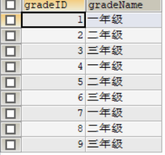
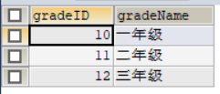
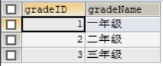
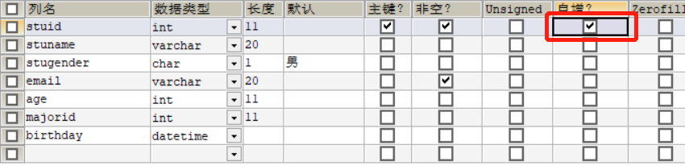

# Data Manipulation Language 数据操作语言


```mysql
/*
说明： insert update delete 对表的数据的增删改查
*/

#一、数据的插入

/*
语法：
插入单行
insert into 表名(字段名1,字段名2,...) value (值1,值2,...)

插入多行
insert into 表名(字段名1,字段名2,...) values (值1,值2,...), (值1,值2,...),...

特点：
：1.字段和值列表--对应
包含类型、约束等必须匹配
# case1 字段和值列表--对应
INSERT INTO students(stuid,stuname,stugender,email,age,majorid)
VALUE(1,'吴倩','男','wuqian@qq.com',12,1);

# 案例2：为空字段的输入（两种写法）
## 方案一：字段名和值都不写
INSERT INTO students(stuid,stuname,email,majorid)
VALUE(2,'李健','wuqian@qq.com',1);
## 等价于【推荐以下用法】
## 方案二：字段名写上，值写null
INSERT INTO students(stuid,stuname,email,age,majorid)
VALUE(2,'李健','wuqian@qq.com',NULL,1);

# case3.默认字段怎么插入
## 方案一：字段名和值都不写
INSERT INTO students(stuid,stuname,email,majorid)
VALUE(4,'齐小鱼','wuqian@qq.com',1);
## 等价于【推荐以下用法】
## 方案二：字段名写上，值写default
INSERT INTO students(stuid,stuname,email,stugender,majorid)
VALUE(4,'齐小鱼','wuqian@qq.com',defaul,1);

# case4：可以省略字段列表，默认所有字段列表，默认所有字段
INSERT INTO students
VALUE(8,'林义','女','lin@qq.com',39,1,'1997-1-30');

：2.数值型的值，不用单引号
非数值型的值，必须单引号

：3.字段顺序无要求
*/

#二、数据的修改
/*
语法：
update 表名 set 字段名 = 新值,字段名 = 新值,...
where 筛选条件
*/
# case1 修改年龄<20的专业编号为3号，且邮箱更改为 xx@qq.com
UPDATE students SET majorid = 1,email='xxx@qq.com'
WHERE age<20;


#三、数据的删除
/*

方式一、delete语句
	语法：delete from 表名 where 筛选条件

方式二、truncate语句
	语法：truncat table stuinfo

*/
#case1 删除姓李的所有信息
DELETE FROM students WHERE stuname LIKE '李%';

#case2 删除表中的所有数据
truncate table stuinfo;

#【面试题】deletehe、truncate的区别
/*
1.delete可以添加where条件
	truncate不能添加where条件，一次性清楚所有数据（属于DDL）
2.truncate效率高

3.如果删除带自增长列的表
	使用delete删除后们重新插入数据，数据从断点处开始
	使用truncate删除后，重新插入数据，记录从1开始
	
4.delete 删除数据，会返回受影响的行数
	truncate删除数据，不会返回影响的行数
	
5.delete删除数据，可以支持事务回滚
	truncate删除数据，不支持事务回滚
*/
```

#### 原表：



#### 一、使用`delete` 删除全表后插入，自增长列序号从断点开始

```mysql
DELETE FROM gradeinfo;
INSERT INTO gradeinfo(gradeName) VALUE ('一年级'),('二年级'),('三年级');
select * FROM gradeinfo;
```




#### 二、使用 `truncate`删除全表后插入数据，自增长列序号从1开始

```mysql
Truncate table gradeinfo;
INSERT INTO gradeinfo(gradeName) VALUE ('一年级'),('二年级'),('三年级');
select * FROM gradeinfo;
```




***

### Trick***:设置自增长列（特别是为id字段为主键的情况）

特点：

1. 自增长列要求必须设置在一个键上，比如主键或唯一键
2. 自增长列要求数据类型为数值型
3. 一个表至多有一个自增长列


方案一：图形化界面




方案二：

```mysql
CREATE TABLE gradeinfo(
	gradeID INT PRIMARY KEY AUTO_INCREMENT,
	gradeName VARCHAR(20)
);

INSERT INTO gradeinfo VALUES (NULL,'一年级'),(NULL,'二年级'),(NULL,'三年级');
## 等价写法
INSERT INTO gradeinfo(gradeName) VALUES ('一年级'),('二年级'),('三年级');
```


*****


# 事务


## 1.什么是事务？为什么要用事务？

​	一个事务是由一条或多条sql语句构成，这一条或多条sql命令要么全部执行成功，要么全部执行失败！


## 2.事务的4大特性（ACID）

* **原子性（Atomicity）**：一个事务不可再分割，要么都执行要么都不执行
* **一致性（Consistency）**：一个事务执行会使数据从一个一致状态切换到另外一个一致状态
* **隔离性（Isolation）**：一个事务的执行不受其他事务的干扰
* **持久性（Durability）**：一个事务一旦提交，则会永久的改变数据库的数据.


```mysql
/*
隐式事务：无明显的开启和结束标记
	比如dml语句的insert、update、delete语句本身就是一条事务
	INSERT INTO students(stuid,stuname,email,age,majorid)
	# 当任一值的类型或者不符合约束整个insert就会失败，所以就是事务
	
显示事务：有明显的开启和结束标记
	一般由多条sql语句组成，必须具有明显的开启和结束标记
	
	步骤：
	取消隐式事务开启的功能
	show variable like '%auto%'
	
	开启事务
	编写事务需要的sql语句（1条以上）
	结束事务
	
	
步骤：
1.取消隐式事务开启的功能
（## 私货：如何查看mysql系统变量  show variable like '%auto%'）
set autocommit = 0;

2.开启事务
start transaction;

3.编写事务需要的sql语句（1条以上）
#将张三丰的钱减5000
UPDATE stuinfo SET balance = (balance - 5000) WHERE stuid = '1';
#将周芷若的前加5000
UPDATE stuinfo SET balance = (balance + 5000) WHERE stuid = '2';

4.结束事务 分两种情况（提交/回滚）
#提交
commit

#回滚
rollback


*/
```

