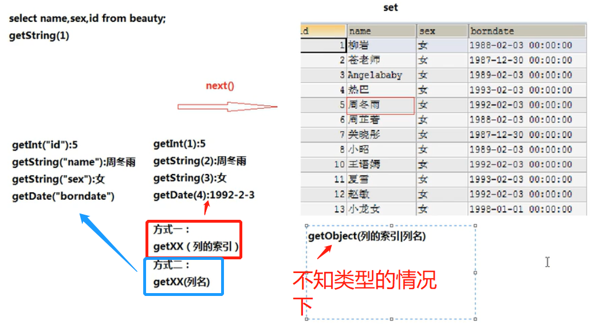
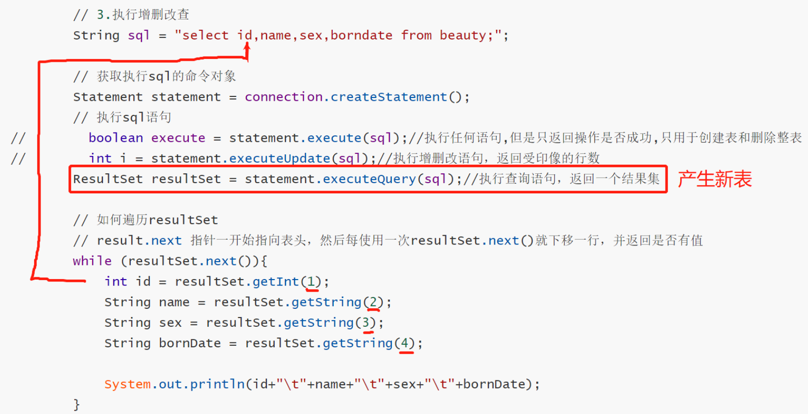

## 本单元目标

1、介绍什么是DBC
2、JDBC的好处
3、通过简单案例演示JDBC的使用步骤【了解】
4、介绍DBC的相关AP★
5、 PreparedStatementStatement和的区别★
6、封装 DBCUtils类，用与获取连接和关闭连接
7、批处理
8、演示事务
9、 Druid德鲁伊连接池的使用
10、 DBUtils开源框架的学习
11、封装DAO【应用】


### 1、介绍什么是JDBC

JDBC：java database connectivity -- JDBC是一个规范（通常规范指的就是一组接口或者抽象类）

2、JDBC的好处
3、通过简单案例演示JDBC的使用步骤【了解】
4、介绍DBC的相关AP★
5、 PreparedStatementStatement和的区别★
6、封装 DBCUtils类，用与获取连接和关闭连接
7、批处理
8、演示事务
9、 Druid德鲁伊连接池的使用
10、 DBUtils开源框架的学习
11、封装DAO【应用】


```mysql
package day6;

/*
* 此类用于演示JDBC的简单使用步骤
 ＠author liyuting
步骤:
前提:准备mysq1的驱动包，加载到项目中
复制 mysql-connefctor---java-5.1.37-bin.jar到项目的根目录下或libs目录下，然后右击 build path
* 1、加载驱动
2、获取连接
3、执行增删改查操作★
4、关闭连接
*
*
* */

import java.sql.*;
import java.util.Properties;
import java.util.logging.Logger;

public class TestConnection01 {
    public static void main(String[] args) throws SQLException {
        // 1. 加载驱动，把类加载到内存
        DriverManager.registerDriver(new Driver() {
            @Override
            public Connection connect(String url, Properties info) throws SQLException {
                return null;
            }

            @Override
            public boolean acceptsURL(String url) throws SQLException {
                return false;
            }

            @Override
            public DriverPropertyInfo[] getPropertyInfo(String url, Properties info) throws SQLException {
                return new DriverPropertyInfo[0];
            }

            @Override
            public int getMajorVersion() {
                return 0;
            }

            @Override
            public int getMinorVersion() {
                return 0;
            }

            @Override
            public boolean jdbcCompliant() {
                return false;
            }

            @Override
            public Logger getParentLogger() throws SQLFeatureNotSupportedException {
                return null;
            }
        });

        // 2.获取链接
        Connection connection = DriverManager.getConnection("jdbc:mysql://localhost:3306/girls","root",
                "root");
        System.out.println("连接成功");

        // 3.执行增删改查

        // 3-1.编写sql语句
        // 删除
//        String sql = "delete from beauty where id = 9;";
        // 更新
//        String sql = "update beauty set name = '关晓彤' where id = 7;";
        // 增加
        String sql = "insert into beauty values (" +
                "null,'小龙女','女','1998-1-1','110',null,3);";
        //


        // 3-2.获取执行sql语句的命令对象
        Statement statement = connection.createStatement();

        // 3-3.使用命令对象指向sql语句,i 返回值得到的是受影响的行数
        int i = statement.executeUpdate(sql);

        // 3-4.处理执行结果
        System.out.println(i>0?"Succeeded!":"Failed!");

        // 4.关闭连接，先关statement后关connection
        statement.close();
        connection.close();

    }
}
```


### 1. 1 步骤一：加载驱动，把类加载到内存

```mysql
package day6;

/*
* 此类用于演示JDBC的使用步骤1：加载驱动
* @author leong
*
* 类的加载时机：
* 1.new 对象
* 2.加载子类
* 3.调用类的静态成员
* 4.通过反射
*
* 使用 new 对象的方式加载类的不足，编译期间就要去看有没有这个类的代码
* 1、依赖性强，如果编译期间该类不存在，则直接编译错误，也就是依赖性强
* 2、导致Driver对象创建了两遍，效率较低
*
* ***静态代码块在类加载的时候就开始执行
*
* 采用反射的方式加载类
* 1、属于运行期加载，大大降低类的依赖性
* 2、Driver对象仅仅创建了1遍，效率较高
*
* 反射的方式加载类有4种：
*
* */

import java.sql.*;
import java.util.Properties;
import java.util.logging.Logger;

public class TestJDBC1 {
    public static void main(String[] args) throws SQLException, ClassNotFoundException {
        // 老方法
        //        DriverManager.deregisterDriver(new Driver() {
//            @Override
//            public Connection connect(String url, Properties info) throws SQLException {
//                return null;
//            }
//
//            @Override
//            public boolean acceptsURL(String url) throws SQLException {
//                return false;
//            }
//
//            @Override
//            public DriverPropertyInfo[] getPropertyInfo(String url, Properties info) throws SQLException {
//                return new DriverPropertyInfo[0];
//            }
//
//            @Override
//            public int getMajorVersion() {
//                return 0;
//            }
//
//            @Override
//            public int getMinorVersion() {
//                return 0;
//            }
//
//            @Override
//            public boolean jdbcCompliant() {
//                return false;
//            }
//
//            @Override
//            public Logger getParentLogger() throws SQLFeatureNotSupportedException {
//                return null;
//            }
//        });


        // 新方法
        Class.forName("com.mysql.jdbc.Driver");
    }
}
```


### 1.2  步骤二：获取连接

```mysql
package day6;
/*
* 此类用于演示JDBC的使用步骤2：获取连接
* */

import java.io.FileInputStream;
import java.io.FileNotFoundException;
import java.io.IOException;
import java.sql.DriverManager;
import java.sql.SQLException;
import java.util.Properties;

public class TestJDBC2 {
    public static void main(String[] args) throws ClassNotFoundException, SQLException, IOException {
        // ***properties配置文件的创建与使用
        Properties info = new Properties();
        info.load(new FileInputStream("src\\jdbc.properties"));
//        info.list(System.out);  // 测试info对象是否获得了properties文本数据
        String user = info.getProperty("user");
        String password = info.getProperty("password");
        String url = info.getProperty("url");
        String driver = info.getProperty("driver");


        // 1.注册成功
        Class.forName(driver);

        //2.获取连接【有三个getConnection的重载】,在java中，机械重复且容易错，最好放在一个配置文件中
//        DriverManager.getConnection("jdbc:mysql://localhost:3306/girls?user=root&password=root");
        DriverManager.getConnection(url,user,password);
        System.out.println("连接成功");


    }

}
```


### 1.3 步骤三：执行增删改查

```mysql
package day6;
/*
 * 此类用于演示JDBC的使用步骤2：获取连接
 * */

import java.io.FileInputStream;
import java.io.FileNotFoundException;
import java.io.IOException;
import java.sql.*;
import java.util.Properties;

public class TestJDBC3 {
    public static void main(String[] args) throws ClassNotFoundException, SQLException, IOException {
        // ***properties配置文件的创建与使用
        Properties info = new Properties();
        info.load(new FileInputStream("src\\jdbc.properties"));
//        info.list(System.out);  // 测试info对象是否获得了properties文本数据
        String user = info.getProperty("user");
        String password = info.getProperty("password");
        String url = info.getProperty("url");
        String driver = info.getProperty("driver");


        // 1.注册成功
        Class.forName(driver);

        //2.获取连接【有三个getConnection的重载】,在java中，机械重复且容易错，最好放在一个配置文件中
//        DriverManager.getConnection("jdbc:mysql://localhost:3306/girls?user=root&password=root");
        Connection connection = DriverManager.getConnection(url,user,password);

        // 3.执行增删改查
        String sql = "select id,name,sex,borndate from beauty;";

        // 获取执行sql的命令对象
        Statement statement = connection.createStatement();
        // 执行sql语句
//        boolean execute = statement.execute(sql);//执行任何语句,但是只返回操作是否成功,只用于创建表和删除整表
//        int i = statement.executeUpdate(sql);//执行增删改语句，返回受印像的行数
        ResultSet resultSet = statement.executeQuery(sql);//执行查询语句，返回一个结果集

        // 如何遍历resultSet
        // result.next 指针一开始指向表头，然后每使用一次resultSet.next()就下移一行，并返回是否有值
        while (resultSet.next()){
            int id = resultSet.getInt(1);
            String name = resultSet.getString(2);
            String sex = resultSet.getString(3);
            String bornDate = resultSet.getString(4);

            System.out.println(id+"\t"+name+"\t"+sex+"\t"+bornDate);
        }


        // 4.关闭连接
        resultSet.close();
        statement.close();
        connection.close();

    }
}
```



#### 最要注意的是：我们获取信息的表是执行sql命令后的虚拟表，所以列的信息和顺序指的是==<u>新表</u>==，而不是==原表==，如下图所示。



